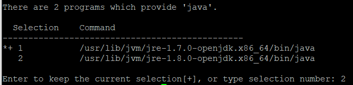

# Study_springboot2-webservice
## AWS 배포

### 1. EC2 서버에 접속하기(windows 환경)

1. putty 다운로드(https://www.putty.org/)
2. puttygen 실행
   - pem -> ppk 변경
     - Conversions - Import Key
     - pem 키 선택 -> Save private key 버튼 -> 경고 창 '예(Y)'
     - ppk 저장 위치 선택, 이름 작성 후 저장
3. putty 실행
   - Session 설정
     - HostName : username@public_ip
       - ex) ec2-user@탄력적 IP
     - Port : SSH 접속 포트인 22
     - Connection type : SSH
   - Auth 설정
     - Category - Connection - SSH - Auth
       - Private key file for authentication - 'Browse...' 버튼
   - Saved Sessions에 이름 저장 후 Save
4. 접속
   - Open
   - '예(Y)' 버튼

### 2. 리눅스 1 서버 생성 시 꼭 해야 할 설정들

1. Java 8 설치

   ```
   sudo yum install -y java-1.8.0-openjdk-devel.x86_64
   ```

   설치 후, 인스턴스의 Java 버전을 8로 변경

   ```
   sudo /usr/sbin/alternatives --config java
   ```

   

   Java 8을 선택(2 입력)

   버전이 변경 되었으면 사용하지 않는 Java7을 삭제

   ```
   sudo yum remove java-1.7.0-openjdk
   ```

   현재 버전이 Java8이 되었는지 확인

   ```
   java -version
   ```

2. 타임존 변경

   ```
   sudo rm /etc/localtime
   ```

   ```
   sudo ln -s /usr/share/zoneinfo/Asia/Seoul /etc/localtime
   ```

   이후, 변경이 되었는지 확인

   ```
   date
   ```

3. Hostname 변경

   ```
   sudo vim /etc/sysconfig/network
   ```

   HOSTNAME을 원하는 서비스 명으로 변경 후 서버를 재부팅

   ```
   sudo reboot
   ```

   재부팅 완료 후,

   ```
   sudo vim /etc/hosts
   ```

   를 입력 후 아래에 ``127.0.0.1 HOSTNAME`` 를 추가한다.

   그리고, 아래 명령어로 확인을 해본다.

   ```
   curl HOSTNAME
   ```

   등록 실패일 경우 : curl: (6) Could not resolve host ~

   등록 성공일 경우 : curl: (7) Failed to connect to ~  / (80 포트로 실행된 서비스가 없음을 의미)

4. MySQL 설치

   ```
   sudo yum install mysql
   ```

   설치가 다 되었으면 로컬에서 접근하듯이 계정, 비밀번호, 호스트 주소를 사용해 RDS에 접근한다.

   ``mysql -u 계정 -p -h host주소``

### 3. EC2 서버에 프로젝트 배포

1. EC2에 프로젝트 Clone 받기

   ```
   sudo yum install git
   ```

   설치가 완료되면 설치 상태를 확인한다.

   ```
   git --version
   ```

   설치 상태를 확인하고 git clone으로 프로젝트를 저장할 디렉토리를 생성한다.

   ```
   mkdir ~/app && mkdir ~/app/step1
   ```

   이후, 생성된 디렉토리로 이동

   ```
   cd ~/app/step1
   ```

   깃허브 웹 페이지에서 https 주소를 복사

   ```
   git clone 깃허브 주소
   ```

   코드들이 잘 수행되었는지 테스트를 진행한다.

   ```
   ./gradlew test
   ```

   만약 Permission denied가 난다면

   ```
   chmod +x ./gradlew
   ```

   을 하면 된다.

2. 실행

   ```
   nohup java -jar 경로/jar파일이름.jar 2>&1 &
   ```

   포그라운드에서 다른 작업을 할 수 있기 때문에 백그라운드로 돌려야한다.

<br>

## 추천 도구

- 댓글 
  - Disqus (https://disqus.com/)
    - 소셜 댓글 서비스. 자바스크립트 코드만 사이트에 등록하면 위젯 형태로 서비스에서 바로 사용이 가능한 댓글 전문 서비스
    - 댓글 기능이 없거나 빈약한 블로그나 커뮤니티 서비스에서는 Disqus를 많이 사용한다.
    - 유료 모델이 존재하지만, 트래픽이 많지 않은 경우 무료로 서비스 사용이 가능하다. 특히나 댓글을 작성한 사람에 대한 기능이 막강해 많은 개인 블로거들이 애용하는 서비스
  - LiveRe (https://www.livere.com/)
    - 국내에서 만든 소셜 댓글 서비스
    - 댓글을 남기기 위해서 별도의 가입이 필요하지 않고, 기존에 사용중인 SNS(카카오톡, 네이버, 페이스북) 계정만 있으면 언제든 댓글을 남길 수 있는 편의성이 있다.
    - 프리미엄 기능 외에 기본적인 기능들은 무료로 지원하고 있음.
  - Utterances (https://utteranc.es/)
    - 흔히 말하는 깃허브 댓글.
    - 깃허브의 이슈 기능을 이용했기 때문에 무료로 사용 가능하다. 특히 깃허브의 마크다운 에디터를 그대로 사용하고 있어 댓글을 마크다운으로 작성할 수 있다는 장점으로 개발자에게 굉장히 친숙한 댓글 기능을 지원할 수 있다는 장점이 있다.
- 외부 서비스 연동
  - Zapier (https://zapier.com/)
    - 수많은 클라우드와 SNS 서비스(750개 이상)들의 오픈 API를 이용하여 서로 간의 연동을 지원한다.
    - 트리거로 이벤트가 발행되면 액션에 등록된 기능이 실행되는 원리
    - ex) 페이스북이 새 글이 올라오면 슬랙으로 메시지를 보내주는 기능
    - 월 100건은 무료로 지원, 그 이상 사용을 원한다면 요금을 지불(매일 1~3번 정도의 요청이면 무료로 사용해볼 만 함)
  - IFTTT (https://ifttt.com/)
    - IFTTT는 IF This Then That의 약자로, 만약 A를 하면 B를 하라는 의미이며 클라우드와 SNS 연동을 지원하는 서비스다.
    - 블로그에 글을 작성하면 ~에 자동으로 링크가 공유하도록 할 수 있음
- 방문자 분석
  - 구글 애널리틱스
    - 구글에서 지원하는 사이트 분석 도구이다. 국내에서도 많ㅇ느 자료가 공유되어 있어 사용하기가 편하다.
  - CDN(Content Delivery Network)
    - 클라우드 컴페어 (https://cloudflare.com/)
      - 해외뿐만 아니라 국내에서도 가장 많이 사용되는 CDN 서비스다.
      - 실제로 국내에서 높은 트래픽을 자랑하는 나무위키 역시 이 클라우드 플레어를 사용하고 있다.
      - 정적 파일들을 캐싱하여 제공하는 CDN의 기능은 무료로 사용할 수 있음.
- 이메일 마케팅
  - Mailchimp (https://mailchimp.com/)
    - 해외에서 서비스 중인 이메일 마케팅 서비스다.
    - 회원 2,000명에게 월 12,000개의 메일을 무료로 보낼 수 있으니 초기에 사용하기 좋음.
    - 특히 반응형을 고려한 뉴스레터나 구독자 관리, 통계, A/B 테스트 등의 기능까지 지원한다.